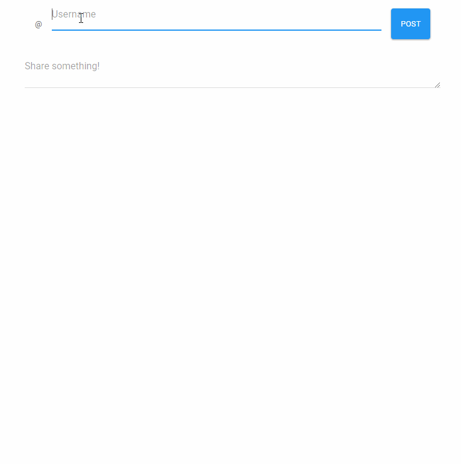

# codess-2018-nodejs 

Completed example of the codess 2018 workshop I ran. ❤️💙💚

This project is designed to be an introduction into nodejs service development! This repository specifically houses an example implementation of a service for sharing brief messages posted by a specific user, and viewable by many.

## Prerequisites

Before you start, please make sure you've installed these things:

* [NodeJS](https://nodejs.org/en/)
* [VS Code](https://code.visualstudio.com/) (or equivalent)
* [Azure CLI](https://docs.microsoft.com/en-us/cli/azure/install-azure-cli?view=azure-cli-latest) (optional, for deployment)

## Usage

To build and run this project, please follow these steps:

* [Clone or download](https://help.github.com/articles/cloning-a-repository/) this repository
* Open a shell (command prompt or terminal should work just fine)
* `cd` into the directory you downloaded the project into
* `npm install` to install NodeJS dependencies
* `npm start` to begin running the service
* Navigate to [http://localhost:3000](http://localhost:3000) to use the test frontend, or use a tool like [Postman](https://www.getpostman.com/) to directly issue requests against the API.

Please feel free to inspect the code (it is well commented) and [open issues](https://github.com/bengreenier/codess-2018-nodejs/issues) with any questions you might have!

## Deployment

To deploy this project to Azure you can click the giant blue button above! However, if you wish to deploy a similar project (or a fork of this project) you may prefer to follow along with [this deployment tutorial](https://docs.microsoft.com/en-us/azure/app-service/app-service-deploy-zip). 👏🏽

## API

[Here are the API docs](https://rebilly.github.io/ReDoc/?url=https://raw.githubusercontent.com/bengreenier/codess-2018-nodejs/master/swagger.yaml)! :sparkles:

## Slides

[Here are the slides](http://slides.com/bengreenier/codess-2018-nodejs) that I presented! :rocket:

## License

MIT
